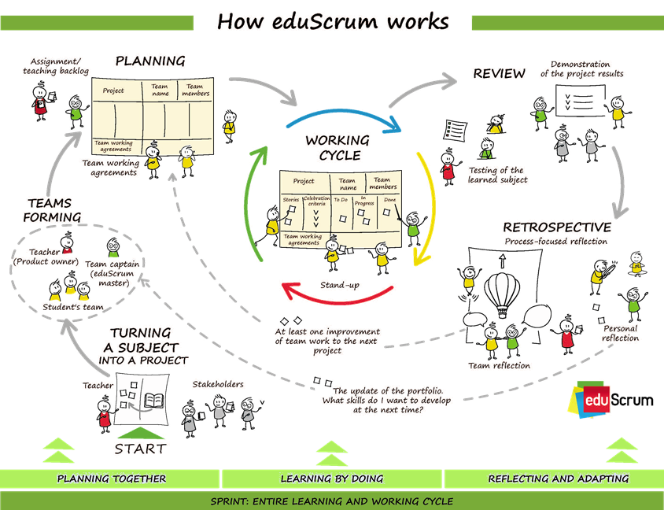

# Theorie zu eduScrum

 Quelle:
[https://eduscrum.org/how-eduscrum-works/#how](https://eduscrum.org/how-eduscrum-works/#how)

## Definitionen

| Wort                     | Bedeutung                                                                                                               |
| :----------------------- | :---------------------------------------------------------------------------------------------------------------------- |
| **Celebration Criteria** | Ziele pro Thema, die Erreicht werden sollen.                                                                            |
| **Definition of Fun**    | Wie gehen wir als Team miteinander um?                                                                                  |
| **Definition of Done**   | Was braucht es, damit eine Aufgabe erledigt ist?                                                                        |
| **Leitfragen**           | Die wichtigsten Fragen die es zu Beantworten gilt.                                                                      |
| **Retrospektive**        | Rückblick und Reflexion über den Sprint. Was war gut? Was kann verbessert werden?                                       |
| **Review**               | Vorstellung der erledigen Arbeiten. Nach jedem Sprint. Zeigen das die Celebration Criteria erreicht wurden.             |
| **Sprint**               | Eine definierte Zeiteinheit in der ausgewählte Arbeiten erledigt werden sollen.                                         |
| **Stand-Up (Daily)**     | Anfangsgespräch pro Nachmittag. 5 Min pro Person. Was habe ich getan? Was werde ich tun? Gibt es Hindernisse (Blocker)? |

## Themen

<DocCardList/>
