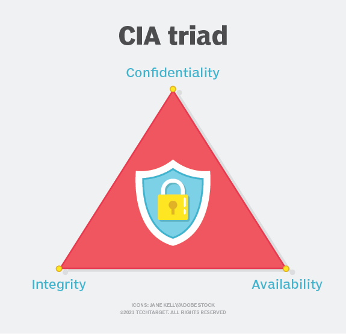

---
keywords:
  - pdf
---

# Datensicherheit

Was ist Datensicherheit?

## 🎉 Celebration Criteria

1. **Kategorisiert Daten aufgrund ihres Schutzbedarfs.**

   - :dart: Kennt verschiedene Kategorien der Schutzwürdigkeit von Daten und
     deren Kriterien.
     - Sie können die Daten Anhand ihres Schutzbedarf Klassifizieren.
   - :dart: Kennt den Unterschied von Datenschutz und Datensicherheit.

2. **Setzt verschiedene Möglichkeiten der Datenspeicherung ein.**

   - :dart: Kennt Verfahren zur Speicherung von Daten und bewusst redundanter
     Datenhaltung (z.B. lokal, Server, Cloud).
   - :dart: Kennt verschiedene Gefahren, denen Daten ausgesetzt sind (z.B.
     Diebstahl, Ransomware, Integritätsverletzung).
     - Sie kennen verschiedene Gefahren für Datensicherheit.
     - Sie kennen können den Begriff Bedrohung, Schwachstelle, Risiko und Asset
       einordnen.
     - Sie wissen die Wahl des korrekt Speicher Medium zum Schutzziel beitragen
       kann.

## :compass: Wegweiser

  
 🤔 Leitfragen 

- Was ist Datensicherheit?
- Was ist das Ziel des Datensicherheit?
- Was ist Datenschutz?
- Datensicherheit vs. Datenschutz?
- Welche Begriffe gibt es im Kontext?
- Was sind die Schutzziele?
- Welche Klassifizierungen gibt es?
- ...

  
 ℹ️ Quellen für die Recherche

- [**Profi AG** Datensicherheit](https://www.profi-ag.de/netzwerk-und-security/datensicherheit/#:~:text=Definition%3A%20Datensicherheit&text=Datensicherheit%20verfolgt%20also%20das%20Ziel,Sicherheit%20von%20Daten%20zu%20gew%C3%A4hrleisten.)
- [**datenschutz.org:** Datensicherheit: Maßnahmen für den Schutz von Daten](https://www.datenschutz.org/datensicherheit-massnahmen/)
- [**Oracle** Was ist Datensicherheit?](https://www.oracle.com/ch-de/security/database-security/what-is-data-security/)
- [**ISARI CONSULT Stefanie Schmidt:** Risiken im Risikomanagement bewerten und beurteilen](https://isari-consult.de/wissen/risiken-im-risikomanagement-steuern)
- [**NCSC:** Schwachstelle](https://www.ncsc.admin.ch/ncsc/de/home/cyberbedrohungen/schwachstelle.html)
- [**NCSC** Cyberbedrohungen](https://www.ncsc.admin.ch/ncsc/de/home/cyberbedrohungen.html)
- [**BSI-Standard:** 200.2 - Kapitel 8.2 Schutzbedarffestellung](https://www.bsi.bund.de/SharedDocs/Downloads/DE/BSI/Grundschutz/BSI_Standards/standard_200_2.pdf?__blob=publicationFile&v=2)

---

## Einstieg in Datensicherheit

### Was ist Datensicherheit?

- Schutz der Daten egal ob personenbezogen oder nicht
- Fokus auf Technischen und organisatorischen Massnahmen

### Was ist das Ziel der Datensicherheit?

Jegliche Daten gegen mögliche Bedrohungen zu Schützen und so die drei
Schutzziele (CIA) umzusetzen.

### Datenschutz vs. Datensicherheit

#### Datenschutz

- Gesetze zum Schutz von personenbezogenen Daten
- Vorschriften zum Schutz von personenbezogenen Daten
- "Legislative" (gesetzgebende Gewalt, Gesetzgebung)

#### **Datensicherheit**

- Massnahmen zum Schutz von Daten (nicht nur personenbezogen Daten)
- "Exekutive" (vollziehende Gewalt)

## Begriffe

### Übersicht der Begriffe

| Begriff           | Beschreibung                                                                                      |
| :---------------- | :------------------------------------------------------------------------------------------------ |
| **Asset**         | Vermögenswert eines Unternehmens                                                                  |
| **Schwachstelle** | Schwachstellen (vulnerability, bug)                                                               |
| **Bedrohung**     | Ereignis das die Verfügbarkeit, Integrität oder Vertraulichkeit von Informationen beeinträchtigen |
| **Exploit**       | Ein Exploit ist das ausnutzen einer Schwachstelle.                                                |
| **Täter**         |  Person welche Schwachstelle ausnutzt und so eine Bedrohnung für die Assets darstellt.            |

## Klassifizierung nach CIA

- Confidentiality (Vertraulichkeit)
- Integrity (Integrität)
- Availability (Verfügbarkeit)

### Übersicht der Kategorien

| Schutzziel      | Mögliche Klassifizierungen                          |
| :-------------- | :-------------------------------------------------- |
| Vertraulichkeit | Öffentlich, Intern, Vertraulich, Streng Vertraulich |
| Integrität      | normal, hoch, sehr hoch                             |
| Verfügbarkeit   | normal, hoch, sehr hoch                             |

#### Vertraulichkeit

| Klassifizierung    | Beschreibung                                                                                                                   |
| :----------------- | :----------------------------------------------------------------------------------------------------------------------------- |
| Öffentlich         | Daten sind für jedermann, auch außerhalb der Firma, zugänglich.                                                                |
| Intern             | Interne Daten werden lediglich den eigenen Mitarbeitern zugänglich gemacht.                                                    |
| Vertraulich        | Vertraulich definierte Daten sind lediglich einer begrenzten Anzahl an Mitarbeitern zugänglich, z.B Personaldaten, Kundenliste |
| Streng Vertraulich | Streng vertrauliche Daten sind punktuell und ausschließlich bestimmten definierten Personen zugänglich.                        |

[**www.sec4you.com:** Klassifizierung ISO 27001](https://www.sec4you.com/klassifizierung-iso-27001/)

#### Integrität, Verfügbarkeit

| Klassifizierung | Beschreibung                                                                                     |
| :-------------- | :----------------------------------------------------------------------------------------------- |
| normal          | Die Schadensauswirkungen sind begrenzt und überschaubar.                                         |
| hoch            | Die Schadensauswirkungen können beträchtlich sein.                                               |
| sehr hoch       | Die Schadensauswirkungen können ein existenziell bedrohliches, katastrophales Ausmass erreichen. |

[**Klassifizierung nach BSI** ab Seite 104](https://www.bsi.bund.de/SharedDocs/Downloads/DE/BSI/Grundschutz/BSI_Standards/standard_200_2.pdf?__blob=publicationFile&v=2)
