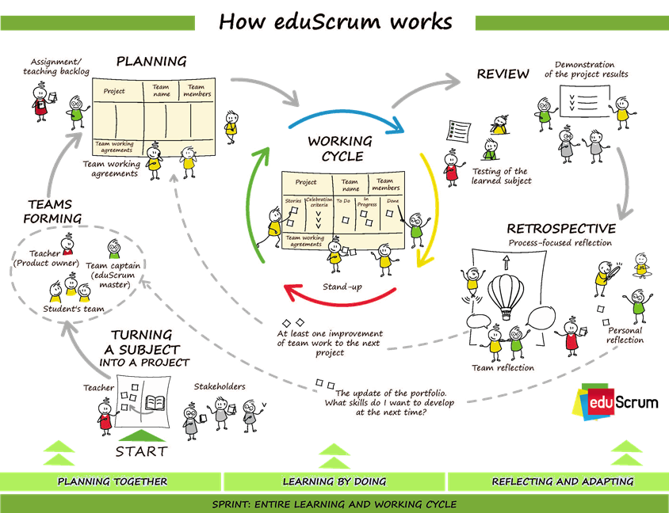

<!-- _class: big center -->

# Woche 1 / Modul 231

### Datenschutz und Datensicherheit anwenden

---

# Agenda

::: columns

- Begrüssung

  - [Moduleinführung](https://codingluke.github.io/bbzbl-modul-231/docs/)
  - [Quartalsplan](https://codingluke.github.io/bbzbl-modul-231/docs/)
  - [LBs](https://codingluke.github.io/bbzbl-modul-231/docs/Beurteilung/)

- eduScrum Einführung
- Gruppen Bilden
- ePortfolio und Miroboard einrichten

:::

---

# Modulidentifikation

| Modulnummer  | 231                                                                                                                            |
| :----------- | :----------------------------------------------------------------------------------------------------------------------------- |
| Kompetenz    | Setzt Datenschutz und Datensicherheit bei Informatiksystemen ein. Überprüft vorhandene Systeme auf Einhaltung von Richtlinien. |
| Lektionen    | 36                                                                                                                             |
| Beschreibung | [231 auf Modulbaukasten.ch](https://www.modulbaukasten.ch/module/231/1/de-DE?title=Datenschutz-und-Datensicherheit-anwenden)   |

---

<!-- _class: small-text -->

# :dart: Modul Handlungsziele

1. **Kategorisiert** Daten aufgrund ihres Schutzbedarfes.

2. Überprüft und verbessert gegebenenfalls die **Datensicherheit** der eigenen
   Infrastruktur.

3. Setzt verschiedene Möglichkeiten der **Datenspeicherung** ein.

4. Überprüft eingesetzte Anwendungen auf Einhaltung der **Datenschutzgesetze**.

5. Zeigt **Konsequenzen** von Fehlern im Datenschutz und bei der Datensicherheit
   auf.

6. Wählt Software für die Einhaltung von Datenschutz und Datensicherheit
   aufgrund der **Lizenzmodelle** aus.

---

# :muscle: Leistungsbeurteilungsvorgabe

::: columns

## LB1 : ePortfolio _(40%)_

- Woche 9
- Gruppenarbeit
- Das ePortfolio wird während den Lektionen fortlaufend erstellt und erweitert.
- Das ePortfolio ist der Lehrperson zugänglich und wird bewertet.

[:link: details ...](https://codingluke.github.io/bbzbl-modul-231/docs/Beurteilung/LB1)

::: split

## LB2-4 : 3 Fachgespräche _(60%)_

- Wochen 4, 7 und 9
- Einzelarbeit
- Fachgespräch nach jedem Sprint (Sprint-Review)

[:link: details ...](https://codingluke.github.io/bbzbl-modul-231/docs/Beurteilung/LB2-4)

:::

---

# :cop: Regeln

- Pünktlichkeit
- Selbständiges Arbeiten
- Internet als Arbeitsmittel

## Wer beim **Gamen** erwischt wird, **backt einen Kuchen** für alle

---

# :dart: Heutige Ziele

- **Modulwebseite** kennen und anwenden

- Sie kennen **eduScrum**
- Es wurden **Gruppen gebildet**
- Die technische Infrastruktur ist aufgesetzt
  - Google Site oder anderes **ePortfolio**
  - Miroboard für **Projektmanagement**

---

<!-- _class: big -->

# Die Modulwebseite [:link:](https://codingluke.github.io/bbzbl-modul-231/)

---

---

# :pencil: Gruppen Bilden

1. 
